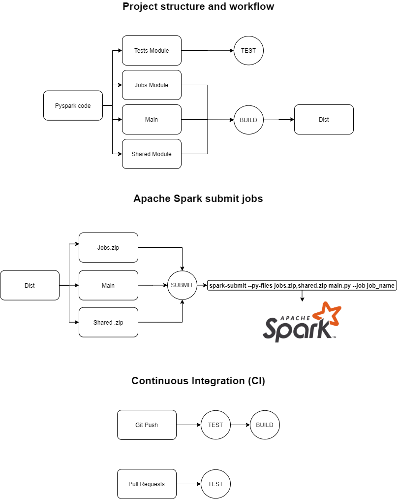
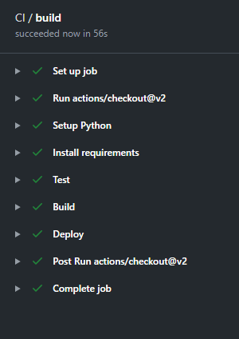

# PysparkProductionReady

 

 

Inspired by: https://youtu.be/Bp0XvA3wIXw

Objectives:

    - Create a sample of a production ready PySpark project
    - Create a CI/CD pipeline for PySpark using pytest and Github Actions

How it works:

    - Using "make" commands to easily test and build commands (more about "make" commands below)
    - Every Push/PR on master runs the unit tests for pyspark Jobs, build and deploy
    - In a Spark cluster, it is needed to pass all dependencies pyfiles to spark-submit command
    - The "build" step generates .zip files and the main.py that can be passed to the spark-submit command

The jobs's transformations can be seen in the ./notebooks folder.

Folders:

    - ./src: pyspark code and Makefile
    - ./notebooks: Jupyter Notebooks
    - ./hdfs: volume used by locally Apache Spark
    - ./docker: custom docker images
    - ./.github/workflows/main.yml: Github Actions config file

Make:

    - make test: run pytest tests
    - make build: build jobs to ./dist folder
    - make all: test and build

Local environment:

    - Apache Spark on JupyterNotebook docker container
    - docker-compose up -d
    - docker/ci_container: container to run make commands

Submit job to Spark on Jupyter:

    - docker exec -w /home/jovyan/scripts jupyter_spark spark-submit --py-files jobs.zip main.py --job test_submit
    - docker exec -w /home/jovyan/scripts jupyter_spark spark-submit --py-files jobs.zip main.py --job purchase
    - docker exec -w /home/jovyan/scripts jupyter_spark spark-submit --py-files jobs.zip main.py --job transaction

CI Container:

    - docker exec -w /app/src ci_container make test
    - docker exec -w /app/src ci_container make build
    - docker exec -w /app/src ci_container make all
